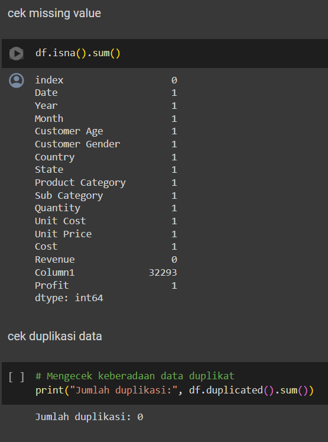

**Exploratory Data Analysis using Python and Tableau (Study Case: Bicycle Equipment Sales Dataset)**

Analisis Data Eksplorasi (EDA) adalah langkah penting dalam mengungkap wawasan yang tersembunyi di dalam kumpulan data, dan dalam postingan kali ini saya akan membahas tentang analisis data yang saya lakukan pada kumpulan data penjualan perlengkapan sepeda (tersedia di Kaggle : [link](https://www.kaggle.com/datasets/abhishekrp1517/sales-data-for-economic-data-analysis/data)) menggunakan dua alat canggih — Tableau Public dan Jupyter Notebook (Python) dengan perpustakaan seperti Matplotlib, Seaborn, dan Pandas. Dalam perjalanan komparatif ini, saya akan memandu Anda melalui metodologi saya di kedua platform.

**INTRODUCTION**

Tim marketing akan mempresentasikan hasil pencapaian pendapatan perusahaan ke jajaran manajer sambil ingin mengukur efisiensi iklan dan situs web yang telah dibuat. Analisis yang dibuat oleh tim marketing akan memperhitungkan berbagai parameter untuk memberikan wawasan kepada manajer, dengan fokus pada perusahaan marketplace di beberapa negara yang menjual perlengkapan sepeda. Setiap negara memiliki keunikan sendiri, mulai dari kualitas barang hingga preferensi pelanggan. Meskipun demikian, pendapatan perusahaan mengalami penurunan dan profit penjualan menurun, menimbulkan permasalahan dalam pendapatan yang perlu diatasi.

**PROBLEM STATEMENT AND GOALS**

**Problem Statement**

- **User/persona:**

Analisa marketing ini ditunjukan untuk jajaran Manajer Marketing.

- **Main Objective Question:**

1\. Bagaimana tren profit secara keseluruhan?

2\. Manakah produk teratas berdasarkan profit?

3\. Sub Kategori Mana yang Paling Menguntungkan?

4\. bagaimana pesentase gender pada data profit?

**Goals:**

1. Membuat dashboard yang akan ditampilkan ke manajer sehingga dapat mengurangi waktu yang lama.
1. Dashboard terdiri dari berbagai parameter/metrics yang membantu manajer membuat keputusan untuk meningkatkan performa bisnis.
1. Menjawab semua pertanyaan yang ditanyakan oleh manajer melalui visualisasi.

**Data Description :**

**Data utama yang digunakan untuk analisa:**

- Date: Tanggal transaksi.
- Year: Tahun transaksi.
- Month: Bulan transaksi.
- Customer Age: Usia pelanggan pada saat transaksi.
- Customer Gender: Jenis kelamin pelanggan.
- Country: Negara tempat transaksi.
- State: Wilayah transaksi atau kejadian terjadi.
- Product Category: Kategori umum dari produk yang terjual.
- Sub Category: Sub kategori spesifik dari produk yang terjual.
- Profit: total pendapatan bersih. dihitung dari hasil sale dikurangi cost

**LANGKAH- LANGKAH Exploratory Data Analysis (EDA)**

**PYTHON**

1\. Mengimpor Pustaka dan Memuat Data

Langkah pertama adalah mengimpor pustaka yang diperlukan seperti pandas, numpy, dan matplotlib, kemudian memuat dataset ke dalam DataFrame pandas. Kita akan menggunakan fungsi read\_csv() untuk membaca data dari file CSV dan menyimpannya dalam DataFrame.

import numpy as np
import pandas as pd
import matplotlib.pyplot as plt
import seaborn as sns
\# Memuat dataset
df = pd.read\_csv('/content/salesforcourse.csv')

2\.Mengeksplorasi Dataset

Selanjutnya, kita akan mengeksplorasi dataset untuk mendapatkan gambaran tentang strukturnya dan isinya. Kita dapat menggunakan fungsi seperti head(), info(), dan describe() untuk melihat beberapa baris pertama, informasi tentang kolom, dan statistik ringkasan masing-masing.

Menampilkan elemen-elemen teratas dari sebuah struktur datainformasi dataringkasan statistik deskriptif dari dataset numerik

3\. Data cleaning:

Mengatasi nilai yang hilang adalah bagian penting dari pembersihan data. Kita akan menggunakan metode seperti isnull(), sum(), dan fillna() untuk mengidentifikasi dan menangani nilai yang hilang dengan tepat.sebelum melakukan cleaning data kita harus cek missing value dan cek duplikasi data.

cek missing value dan cek duplikasi data.

dari gambar diatas bisa dilihat bawah terdapat missing value pada kolom column1 maka kita drop 1 kolom semua saja sedangkan untuk missing value yang lain kita drop juga. maka hasilnya seperti gambar di bawah ini.

cleaning missing value

4\. Outlier Data Dan Karelasi Data

Outlier data adalah nilai yang signifikan berbeda dari mayoritas data dalam dataset, Identifikasi outlier penting karena dapat mempengaruhi analisis.

profit dan country

sementara korelasi data menggambarkan hubungan antara variabel.korelasi membantu memahami hubungan antar variabel. Meskipun korelasi memberikan wawasan, perlu diingat bahwa tidak selalu menunjukkan sebab-akibat, dan evaluasi lebih lanjut bisa diperlukan untuk pemahaman yang lebih dalam.

korelasi setiap data

**TABLEAU**

**Build Dashboard and Gain Business Insights**

- Bagaimana tren penjualan secara keseluruhan**?**

Grafik menunjukkan tren positif keuntungan dari Januari 2015 hingga Desember 2016, dengan fluktuasi musiman. Kinerja 2016 lebih baik daripada 2015, menunjukkan pertumbuhan dan peningkatan profitabilitas.

Fluktuasi musiman menunjukkan keuntungan lebih tinggi di akhir tahun (Oktober-Desember) dan lebih rendah di awal tahun (Januari-April). Hal ini mungkin terkait dengan periode liburan dan penjualan yang lebih tinggi di akhir tahun. Penurunan keuntungan signifikan pada April 2015, September 2015, dan Februari 2016, mungkin disebabkan oleh faktor ekonomi, perubahan strategi bisnis, atau faktor eksternal lainnya.

- Manakah produk teratas berdasarkan keuntungan**?**

- Sub Kategori Mana yang Paling Menguntungkan?

- bagaimana pesentase gender pada data profit?

- apakah perbedaan tempat terjadinya transaksi mempengaruhi Profit dalam product category?

CONCLUSION

1\. Bagaimana tren profit secara keseluruhan?

terdapat tren kenaikan dalam profit berdasarkan tahun ke tahun. Persentase Kenaikan=(1,684,362 / 288,620)×100%p profit mengalami *kenaikan sekitar 583.12%* dari tahun 2015 ke tahun 2016. Hal ini menunjukkan bahwa bisnis ini cenderung mengalami pertumbuhan dalam periode waktu yang diamati. sedangkan untuk tren per bulan pada bulan june tahun 2015 mengalami kenaikan presentase sampai akhir tahun. ini berbeda dengan bulan juni tahun 2016 yang mengalami penurunan sekitar 12%

2\. Manakah produk teratas berdasarkan profit?

• Berdasarkan data profit, produk yang menonjol adalah *accesories*. Produk ini memiliki kontribusi profit yang signifikan terhadap keseluruhan profit perusahaan.

3\. Sub Kategori Mana yang Paling Menguntungkan?

Sub kategori yang paling menguntungkan adalah *helmets, tires dan tubes.* Sub kategori ini mencatat profit tertinggi dibandingkan dengan sub kategori lainnya. Hal ini menunjukkan potensi besar dari sub kategori ini dalam menghasilkan profit bagi perusahaan.

4\. bagaimana pesentase gender pada data profit?

Dari analisis gender pada data profit, terlihat bahwa persentase pria/wanita dari total profit sama ya. Hal ini menunjukkan bahwa tidak ada hubungan yang signifikan antara kontribusi profit dari kedua gender dalam dataset ini dari segi manapun baik itu country maupun product.

5\. apakah perbedaan tempat terjadinya transaksi mempengaruhi Profit dalam product category?

Analisis menunjukkan perbedaan pendapatan yang signifikan antara lokasi transaksi. Untuk total profit, Jerman adalah yang terbesar. Artinya *Jerman mendapat keuntungan* lebih banyak untuk setiap item atau setiap transaksi.

**RECOMENDASI**

Berdasarkan hasil analisis EDA penjualan perlengkapan sepeda, berikut beberapa rekomendasi untuk meningkatkan efisiensi iklan dan profit perusahaan:

1. Fokuskan pemasaran pada produk unggulan seperti aksesori untuk meningkatkan visibilitas dan promosi produk tersebut.
1. Optimalisasi inventaris produk, terutama untuk sub kategori seperti helmets, tires, dan tubes yang menyumbang profit signifikan.
1. Pertimbangkan diversifikasi produk untuk memperluas jangkauan dan meningkatkan potensi profit.
1. Lakukan segmentasi pasar berdasarkan lokasi transaksi untuk menyusun strategi pemasaran yang lebih terfokus sesuai dengan preferensi konsumen di setiap wilayah.

Dengan menerapkan rekomendasi ini, diharapkan perusahaan dapat meningkatkan efisiensi iklan dan profitabilitas mereka dalam pasar perlengkapan sepeda.

Terimakasih telah membaca analisa ini, berikut saya lampirkan terkait code, dashboard(tablaue), dan link vidio presentasi.

1. Linkedin : [Risky_deva](https://www.linkedin.com/in/risky-devandra-hartana/)
1. Tableau : [dashboard_tableau](https://public.tableau.com/views/ProjekIIVisualisasipaacman/Dashboard1?:language=en-US&publish=yes&:sid=&:display_count=n&:origin=viz_share_link)
1. Github : 
1. Youtube : 

